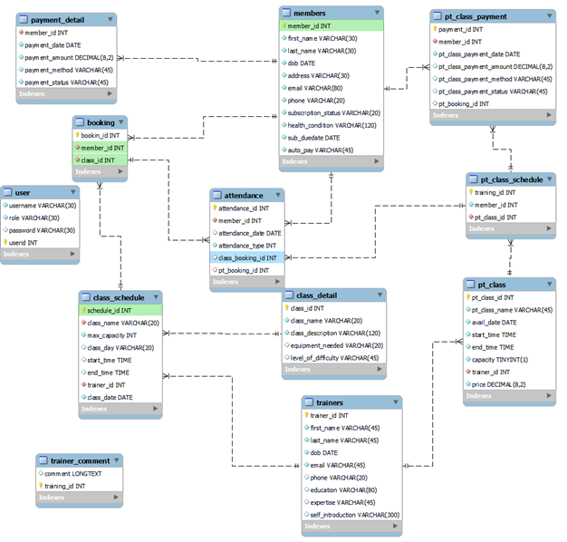

# comp639-2023-project1-group17

## 1.	Project Details
Project name:	Lincoln Fitness Club Management System

Issue date:	31st March 2023

Group 17:

        Na Bian 

        Yu-Tzu Chang  

        Bree He 

        Niaofei (Liz)Shao 

        Frank Niu 

## 2.	Purpose of the Project
The fitness club management system helps Fitness club’s staff to manage the club’s operations efficiently. It includes features such as membership management, scheduling, payment processing, staff management and reporting. The system may also have more features for members such as book class or training session. It also allows trainers to manage the members and their personal information. The primary goal of the fitness club management system is to streamline gym operations and provide a better experience for members.
## 3.	User Stories

### User Story	#13 All users log in
Assigned To	Na
Hour Worked	12 hours

Description
As a user, 
I want to   be able to log in to the gym website,
So, I can use the features on the website like book classes, change profile, etc.

Acceptance Criteria	 
Users cannot log in without filling in the correct username.
There are different interfaces for admin, trainer, and members.
Login can be found in the navigation bar.
Alert when entering the wrong username.

Status	Completed

### User Story	#1 Admin: add member
Assigned To	Na
Hour Worked	16 hours

Description	
As an admin, 
I want to   be able to add member details,
so that I can help new members to register and join the gym.

Acceptance Criteria	
An admin cannot submit a form (add or edit member) without filling out all the mandatory fields of members. 
The member id cannot be changed.
Member options are in the navigation bar.  
Provide confirmation after the admin's operation on the member detail system.

Status	Completed

### User Story	#2 Admin: search members by id/name
Assigned To	Na
Hour Worked	10 hours

Description	
As an admin, 
I want to be able to search members by name or id,
so that I can view and find member details easily.

Acceptance Criteria	
The member id cannot be changed.   
Member options are in the navigation bar.  
Allow the admin to view the selected member details in a clear and organized format.
Status	Completed

### User Story	#3 Admin: update information and change subscription status
Assigned To	Na
Hour Worked	16 hours

Description	
As an admin,
I want to update members’ information and change members’ subscription status,
So that I can keep the members’ information up to date.

Acceptance Criteria	
The member id cannot be changed.
Member options are in the navigation bar.  
Allow the admin to view all existing member details in a clear and organized format. 
Allow the admin to edit existing member details and update the records in real-time.
Allow the admin to change the member subscription status from active to inactive when they want to cancel their subscription. 
Provide confirmation after the admin's operation on the member detail system.

Status	Completed

### User Story	#8 Member: make payment
Assigned To	Na
Hour Worked	10 hours

Description	
As a member,
I want to make payments for membership subscription/renewal. 
So that I can sign up as a new member or renew my membership.

Acceptance Criteria	
Members can choose the payment method from cash/EFTPOS or online payment.
Members can setup auto-renewal in the system
Members can check how much they would pay before paying.
The system will show if the payment is successful or not.

Additional task done:
When members choose auto to pay, their subscription status is always active, and the payment will be done automatically. Whenever the admin or member logs in, the due date will be checked if less than seven days, the payment will be made.

Status	Completed

### User Story	#3 Admin: send reminders to gym member when the subscription is due
Assigned To	Na
Hour Worked	12 hours

Description	
As an Admin,
I want to send reminders to gym members when the subscription due
so that gym members are aware of the subscription status and make payment arrangements in advance.

Acceptance Criteria	
The system will automatically send reminders out.
There are dates left shown when the member logs in.

Changes:
There are some changes to this acceptance criteria. In the beginning of the project, we plan to let admin to send reminders to whose due date is coming. However, we did discuss within the team, instead of letting admin to send reminders every day, it is better their reminder pop up once the member log into the system.

Status	Completed

### User Story	#5 Member: View member’s profile
Assigned To	Bree
Hour Worked	10 hours

Description	As a member, 
I want to view my profile, 
so that I can see my personal information and check its accuracy.

Acceptance Criteria	
Members can view their own profile information.
The profile information includes personal details such as name, address, phone number, email, and membership status.

Additional completed tasks: 1. name and date of birth couldn’t be changed. 2. Members can view their bookings by click button” My Booking” in their profiles.

Status	Completed

### User Story	#16 Member: update member’s profile
Assigned To	Bree
Hour Worked	26 hours

Description	
As a member, 
I want to update my profile, 
so that I can keep my personal information up to date.

Acceptance Criteria	
Members can update their profile information.
The profile includes personal details such as name, address, phone number, email, and membership status.
After updating their profile, members can see their updated profile information.

Additional completed tasks: 1. Confirmation prompt will pop up when user click save button. 2. Successful message will be displayed after submission. 3. Set the display of phone format to XX-XXX-XXXX.

Status	Completed

### User Story	#22 Member: view the list of trainers
Assigned To	Bree
Hour Worked	9 hours

Description	
As a member, 
I want to view the list of trainers.
So that I can easily select a trainer according to my needs.

Acceptance Criteria	
The list of trainers is displayed on the system.
The list shows the name of each trainer.
Members can click on a trainer’s name to view their full profile.
The trainer’s profile includes information such as their specialties and certifications.

Status	Completed

### User Story	#6 Member: view the exercise sessions
Assigned To	Bree
Hour Worked	12 hours

Description	
As a member, 
I want to view the sessions. 
So that I can easily select a session according to my needs.

Acceptance Criteria	
The system displays the weekly exercise schedule.
The schedule shows the name and time of each session.
Members can click on a session to view its full description.
The session description includes information on equipment needed and level of difficulty.

Additional completed tasks: 1. Change the session schedule table to calendar-like format.

Status	Completed

### User Story	#30 Admin: view the popular classes
Assigned To	Bree
Hour Worked	16 hours

Description	
As an Admin,
I want to view the popular classes,
So that I can keep track of the classes most attractive to the gym members.

Acceptance Criteria	
Show the popular classes with trainers' names, class times, and the number of bookings.
The list can be shown as a week, a month, or a quarter.
Popular classes are listed in descending order of the number of bookings.

Changed some content of this user story: 1. Dropped the original plan that required popular classes to show the names of group members. 2. Changed the original plan from ranking by attendance to ranking by number of classes booked.

Reasons: 1. Because there is no need to display the member’s name. 2. The number of bookings shows the popularity of the class, attendance sometimes only stands for the individual member performs.

Status	Completed

### User Story	#23 Member:  view when a trainer is available for a personal session
Assigned To	Frank
Hour Worked	15 hours

Description	
As a member
I want to view when a trainer is available for a personal session.
So that I know when that trainer is available for personalize training sessions.

Acceptance Criteria	
The member should be able to view the trainer's availability for personal training sessions.
The availability should be displayed in a clear and easily understandable manner, such as a calendar or timetable view.
The availability information should be up-to-date and exact.
The member should be able to filter the availability by date, time, and trainer name.
The member should be able to book a personal training session with the trainer, based on their availability.
The system should allow the member to cancel or reschedule the session, subject to the trainer's availability and cancellation policy.

Additional completed tasks: 1. Updated SQL table after booking a personal training to make the one-to-one session unavailable for booking again. 2. Added validation step and stop members to book personal training session if their membership subscription is expired. 

Changed some content of this user story: 1. Instead of filtering the availability by date, time, and trainer name, now there are three filters available for members to choose from which are date, trainer name and training session type. 2. The system is not allowed the members to cancel or reschedule the session.

Reasons: As personal training session is not a free gym service, cancel or reschedule may need to process refund which wasn’t considered before, and it is difficult to make it happen.

Status	Completed

### User Story	#25 Member:  make payment (specialized class)
Assigned To	Frank
Hour Worked	16 hours

Description	
As a member,
I want to make payments for specialization training.
So that I can book a specialization training session.

Acceptance Criteria	
Members can choose the payment method from cash/EFTPOS or online payment.
System will show if the payment is successful or not.
Members can check how much would they pay before paying.
The specialization training session booking won’t be successful if the payment is unsuccessful.

Added completed tasks: After the payment, there will be a review page to remind members which training session they were booked.
Changed some content of this user story: Members can only make the payment through online payment.

Reasons: Cash and EFTPOS payment is difficult to be simulated in the system.

Status	Completed

### User Story	#7 Member book class
Assigned To	Liz
Hour Worked	20 hours

Description	
As a member,
I want to book an exercise class,
So that I can choose the class that suit my need.

Acceptance Criteria	
Show the exercise class schedule for the next four weeks (class name, time, and the number of people).
Members can select available classes.
each class can only accommodate a maximum of 30 members.
Only one class can be selected for the same period.
Members can know if the choice was successful.

Status	Completed

### User Story	#32 Admin: see a summary report of members’ attendance
Assigned To	Frank
Hour Worked	10 hours

Description	
As a manager,
I want to be able to see a summary report of members’ attendance.
So that I can check the members’ use of gym facilities.

Acceptance Criteria	
The manager should be able to view a summary report of members' attendance over a specified period, such as a week or a month.
The report should include the average number of visits made by members per day or week.
The report should include a breakdown of visits by facility or service, such as gym, or personal training.
The report should be presented in a clear and easy-to-understand format, such as a table or chart.

Changed some content of this user story: There is no average number of visits being included in this attendance report.

Reasons: Because the daily summary, attendance summary from a selected period can give the administration enough information for gym management. Average attendance may not very necessary at this stage.

Status	Completed

### User Story	Trainer view and update member’s information
Assigned To	Liz
Hour Worked	20 hours

Description	
As a Trainer,
I want to view the trainee's information and add comments.
So that I can supply the training sessions according to their needs.

Acceptance Criteria	
Trainers can see the information of member details including name, email, phone number, health condition.
Trainers can add comment to individual member so as to recommend the proper training session.

Status	Completed

### User Story	#24– Trainer updates their information
Assigned To	Liz
Hour Worked	20 hours

Description	
As a Trainer,
I want to view and update my personal information.
So that I can keep my personal information up to date.

Acceptance Criteria	
Trainers can see the information of their personal details including name, email, phone number, ability and education.
Trainers can update the personal information to keep track of it.

Status	Completed

### User Story	#24 Trainer: view and update my profile details
Assigned To	Liz
Hour Worked	12 hours

Description	
As a trainer,
I want to be able to see my profile details. 
So that I can monitor that my details are up-to-date and correct.

Acceptance Criteria	
The trainer should be able to view their profile details, including their name, contact information, and qualifications (Done by Special)
The trainer should be able to edit their profile details, in case of any changes or updates (Done by Liz)
The changes made to the profile details should be saved and reflected accurately in the system (Done by Liz)
The trainer should be able to view their current schedule, including any personal training sessions they have booked (Done by Special)

Changes:
We did not give the trainers to change the availability time, as we have other obstacles in other user stories that need to be fixed.

Status	Completed

### User Story	#4 Admin: view trainer’s classes
Assigned To	Yu-Tzu Chang(Special)
Hour Worked	12 hours

Description	
As an admin,
I want to view the trainer's classes. 
So that I know who’s taking what class and when.

Acceptance Criteria	
showing timetable with class/trainer name for the current month
the admin can search certain classes/trainers/months from the filter
accessible from the admin interface

Status	Completed

### User Story	#26 Admin: report of member’s subscription status
Assigned To	Yu-Tzu Chang(Special)
Hour Worked	12 hours

Description	
As an admin,
I want to be able to view a report of members’ subscription status. 
So that I can identify the currently active members who are paying their monthly subscription for their gym membership.

Acceptance Criteria	
The manager should be able to access a report that displays the subscription status of all members.
The report should show the name, contact information, and subscription status (active or inactive) of each member.
The report should be filterable by date range, membership type, and other relevant criteria.
The report should be updated in real-time, reflecting any changes in the subscription status of members.

Additional tasks are done:
We add an export function for the admin to use, a CSV file will download with the current table showing on the webpage.

Status	Completed

### User Story	#28 Admin: view a financial report for the gym
Assigned To	Yu-Tzu Chang(Special)
Hour Worked	16 hours

Description	
As an admin,
I want to be able to view a financial report for the gym. 
So that I can identify the current financial status of the gym

Acceptance Criteria	
The manager should be able to view a financial report that shows the gym's revenue and expenses over a specified period, such as a month or a year.
The report should include the total revenue generated by the gym during the specified period, broken down by revenue streams, such as membership fees and personal training fees.
The report should show the net income of the gym, which is the revenue minus expenses, for the specified period.
The report should be presented in a clear and easy-to-understand format, such as a table or chart.

Changes:
We don’t have an expense table in the database and this system’s purpose is for project use, so we decided to show the revenue table only.

Status	Completed

## 4.	Solution

### Data Model:

### GUI Design
### 1.	Introduction
The Fitness Club Management System is a software application that allows gym staff to manage gym operations and member activities. The purpose of this GUI design report is to supply a comprehensive overview of the graphical user interface (GUI) design for the Gym Management System. Three different interfaces are designed for admin staff, members and trainers after logging in.

### 2.	Navigation and design template/layout
Navigation: 
The Fitness Club Management System has a clear and easy-to-use navigation menu that allows users to quickly access the system's unique features and sections. The navigation menu is prominently displayed on every page of the system and include links to important sections such as member management, class schedules, session schedules, and reports.

Design Template/Layout: 
The design template for the Fitness Club management system is clean, modern, and visually appealing. It includes a combination of text, images, and icons to make it easy for users to navigate and understand the distinctive features of the system. The layout of the system is designed with usability in mind, with key features and sections prominently displayed and easily accessible.

The home page of the system supplies an overview of the most notable features and sections of the system, including upcoming classes, member statistics, and trainer information. The member management section should allow admin to easily manage member accounts, including contact information and membership status.

The class schedule section allows members to view class schedules, including class descriptions and times. 

The reports section of the system provides Fitness Club staff with access to important data and statistics, such as revenue. 

Overall, the design template and layout of the Fitness Club management system is focused on usability, simplicity, and efficiency, with clear navigation and easy access to all the features and sections of the system.

### 3.	Use of different components/widgets
Header/Footer: 
The Lincoln fitness club website's header have obvious navigation links to the site's various pages, such as those with class schedules, personal training session, and information about the trainer.

Hero section: 
The hero section consist of a sizable banner image with a call-to-action button enticing site visitors to find out more about the gym or to join up for a membership.
Class schedules: There is a table that displays the daily or monthly class schedules for the gym.

Trainer profiles: 
There is the card element that describes each trainer's background and areas of specialisation.

### 4.	Color scheme and graphics
The dashboard is the first page which has the Lincoln University logo on the top left. 
Blue and white are the main colors of Lincoln University's website, therefore we choose blue and white. These two colors are used to keep consistency with the overall brand identity. The dashboard supplies an overview of the gym's activities, such as photos of the gym and session information. The dashboard is designed to be visually appealing and easy to navigate, allowing gym members to quickly get a sense of what is happening in the gym. The buttons are mainly in blue. The buttons are easy to find and clearly labeled. We use blue as the color for the main navigation bar and other essential elements, such as buttons or links, to make them stand out and easily accessible. White is used as the background color for content areas, such as the class schedule or member information, to make them easy to read and navigate. Overall, using blue and white as the main colors for the GUI design can create a clean, professional, and consistent look that aligns with the brand identity of Lincoln University.

### 5.	Functionality and Features

Member Management:
The member management interface allows gym staff to manage member information, such as their contact details and membership status. The member management interface is designed to be easy to use and allows gym staff to quickly access member information. 

Class and Schedule Management:
The class and schedule management interface allows gym staff to view class schedules. Members can view and sign up for classes online, and the interface displays class availability and any prerequisites or restrictions. The interface is designed to be intuitive, allowing gym staff to easily view classes and schedules. Trainers can also use their interface to view their schedule and the information about the members.

Reporting:
The reporting interface allows gym staff to view and analyze data on gym usage, member activity, and other important metrics. The interface is designed to be easy to use and allows gym staff to make informed decisions about how to improve the gym experience for members.

### 6.	User Experience

The UX (user experience) for a fitness club management system prioritize ease of use and efficiency for both staff and members. 

Intuitive Navigation: The system be easy to navigate, with a clear and organised menu structure that allows users to quickly find the information they need.

Responsive Design: The system responsive and optimised for all devices, including desktops, tablets, and mobile phones.

Consistent Design: Consistency in design elements such as colors, typography, and layout kept throughout the system.

Low User Input Requirements: The system reduces the quantity of user input necessary and eases data entry and access. Users receive clear feedback and messaging from the system, including notifications, success messages, and error messages.

Personalization: The system allows for personalization, such as customization of workout plans or class schedules, to meet the specific needs and preferences of individual members.

In general, the UX for a management system for a fitness club is created with the intention of making it as simple and effective as possible for both staff and members to manage and obtain information about the fitness club.

### 7.	Conclusion
In conclusion, the GUI design for the Gym Management System is designed to be visually appealing, easy to use, and efficient. The GUI design allows gym staff to manage all aspects of the gym experience, including member management, class and schedule, and reporting. The GUI design is intuitive and designed with gym staff, trainers and members in mind, supplying an easy-to-use and efficient way to manage all aspects of the gym experience.

Validation and Verification
The system has implemented a range of validation and verification functions to enhance its reliability and accuracy. Firstly, the system permits users to log in using their email address as a username, and grants access to different interfaces based on the user type stored in the database. The system ensures that only valid usernames, which exist in the database, are permitted to log in, thus mitigating the risk of unauthorized access.
Secondly, the system employs validation checks for membership status. Members are reminded of their upcoming membership expiration date, seven days in advance, thereby ensuring timely renewals. The system restricts inactive members from booking any group classes or personal training sessions and simulates gym entry by validating active membership status. The system provides login access for all members; however, gym access is only granted for those with active membership status.

Thirdly, the system applies validations on data input for adding new members and payment processing. The system employs logical checks to validate input formats and ensures the validity of payment card details. The system provides real-time feedback and suggestions to guide users in correcting any incorrect input, thus reducing the possibility of errors and improving data accuracy.

Lastly, the system manages the availability of group classes and personal training sessions to prevent duplicate bookings and to ensure that the maximum number of attenders is not exceeded. The group class roster is updated on a weekly basis, and the system automatically refreshes the available number of group classes once the current week has passed.

## 5.	Review of the Final Artefact
### 1.	Introduction:
The fitness club management system is a powerful tool that helps gym staff streamline their operations and improve the customer experience. This management system supplies a range of features and functionalities designed to make gym management more efficient and effective.

### 2.	System requirements:
It is necessary for users to have access to a web browser and an internet connection to utilize the system, and they must provide their own unique login credentials to gain entry and utilize its features. It is presumed that the system has appropriate API configurations in place to enable members to complete payment transactions using their bank cards.
### 3.	Functionalities:
Staff at the gym can examine class schedules using the interface for managing classes and schedules. The interface shows available classes as well as any prerequisites or restrictions, and members can watch and register for classes online. The user-friendly interface makes it simple for gym staff to watch classes and schedules. Trainers can also access their schedule and member details on their interface. 
The reporting interface enables gym staff to view and examine information on member activity, gym use, and other crucial metrics. The user-friendly interface enables gym employees to make defensible choices about how to enhance members' gym experiences.

### 4.	User interface
The user interface is intuitive and user-friendly, making it easy for gym owners and staff to navigate and use. The system supplies a centralized dashboard that gives a real-time overview of gym operations. Both the Club Admin, Club members and trainers can find the function button they need from the dashboard.

### 5.	Testing and Quality assurance
As a first step, define the testing objectives: conduct user acceptance testing to ensure that the web project meets the needs and expectations of the end users. 
Second, track and manage defects: keep track of issues or defects that are discovered during testing.
Thirdly, perform regression testing after defects have been resolved to ensure that the changes have not introduced new problems.
Last but not least, monitor performance: keep track of the website's performance to ensure that it meets quality standards.

### 6.	Deployment and Maintenance
Deploy the web app on PythonAnywhere needs the code and database to meet its requirement. As their MySQL database is case-sensitive, you must implement the code and data carefully. After the web app successfully runs on PythonAnywhere, regular monitoring, maintenance, and updates can also help to ensure that the web project remains secure and up-to-date and meets its users' needs and expectations.

### 7.	Conclusion
Based on our work, we have developed a fitness club management system, which is a web application that helps gym staff manage gym operations, schedules, and member activities. To access the system, users need a web browser and an internet connection, and we presume that the appropriate API configurations are in place to enable members to complete payment transactions.

We have included various functionalities in the system, such as managing classes and schedules, accessing member and trainer details, and viewing and examining gym metrics. The user interface is intuitive and user-friendly, with a centralized dashboard that provides a real-time overview of gym operations.
To ensure that the web application meets end-users' needs and expectations, we defined testing objectives, tracked and managed defects, and performed regression testing after defect resolution. We also ensured regular monitoring, maintenance, and updates to keep the web application secure and up to date.
Overall, we are proud to have developed a valuable tool for gym staff to streamline gym operations and enhance the customer experience.

## 6.	Team Performance

Our team adopted agile method and used the Scrum framework to manage our project tasks. By breaking down the project into smaller, more manageable tasks, we were able to work more efficiently and stay on track with our goals. We started off strong, with clear goals and effective communication among team members. Each team member's strengths were used to achieve project tasks efficiently.

During the sprint planning meetings, we prioritized the backlog of tasks and estimated the amount of time needed for each task. This allowed us to set realistic goals for each sprint and ensure that we met our deadlines. However, we met unexpected obstacles in Sprint 2, which caused a backlog of unfinished tasks, leading to delays in meeting our deadlines.

We addressed these issues by catching up on our backlog in Sprint 3. In retrospect, we found the need for more thorough code reviews, particularly for higher-level functionalities, to avoid blind spots. Also, we recognized that we need to complete tasks more efficiently by finishing one task before starting the next.

The Scrum Master played a crucial role in easing the Scrum framework and ensuring that the team adhered to the agile principles. By fostering a collaborative and transparent work environment, the Scrum Master helped to ensure that the team worked effectively and efficiently.

Moving forward, we will continue to use agile method and the Scrum framework in our future projects. We will conduct a risk assessment at the outset of our next project to name potential roadblocks and challenges. We will also set more realistic timelines based on a more thorough understanding of the tasks involved. Furthermore, we will prove clear guidelines for communication and follow up regularly with team members who are less responsive.

In conclusion, our team communicated well and worked effectively, but we have shown areas that need improvement to ensure that we continue to grow and improve as a team in the next project. By considering the lessons learned from this project and continuously striving to improve our project management process, we can ensure that we deliver high-quality results promptly.

## 7.	Lessons Learned

### Member: Na Bian

Sprint 1:
I learned how to build a database based on entity relationships and the entity relationship diagram. Also, I found the materials for blueprint which is a way to organize related views, templates, and static files in a modular and reusable way. In this project, we used blueprint to break down a large Flask application into smaller, self-contained modules that can be easily managed and supported. The modules include trainer, member and admin, which makes the maintenance in the future clearer and easier. 

Sprint2:
I added the scheduled job to the project, however, it does not work on python anywhere. Instead, I add some functions when users log in which can meet the requirements for scheduled job. Therefore, there are always diverse ways for solutions.

Sprint 3:
I have learned the idea of Agile, and the importance of teamwork. Agile allows for frequent feedback and adaptation throughout the development process. The issues can be named early on, and we can make changes within the team. We work more closely and communicate effectively to get the work done on time.

### Member: Frank Niu

Firstly, Collaboration and Communication: As a team, we must work together to achieve our common goal, which needed effective communication, task allocation, and coordination. I have learned how to share responsibilities, set deadlines, and communicate effectively to ensure everyone was on the same page then finish the task on time.

Secondly, Technical Skills: I have learned a lot how to use the program language more efficiently and applied more functions and templates to my own code, as well as how to integrate different components of the system.

Thirdly, Problem Solving: As with any software development project, I met various technical challenges and obstacles during these days. I have learned how to troubleshoot and debug code, as well as how to use online resources like Stack Overflow to find solutions to technical problems and make it correct.

Finally, Testing and Quality Assurance: To ensure that the online fitness club management system was functional and user-friendly, we perform various tests, including function testing, integration testing, and acceptance testing. I learned how to write test cases, execute tests, report bugs, and use version control tool to manage changes and revisions.

### Member: Bree He

Sprint 1:
Asking teammates for help when encounter problems.
Ensure that the tables in the database are linked correctly before trying to retrieve data from them.
When using Flask web framework, make sure to use the proper method to retrieve values.

Sprint 2:
Pay close attention to routes when using Flask blueprint, as errors can arise from incorrect URLs.
When updating data in multiple tables simultaneously, it may be necessary to add new columns and use foreign keys to link the tables.
Learn how to solve merge conflicts effectively on GitHub to avoid delays in completing tasks.
When meeting technical issues, review the code and restart the computer before seeking help.

Sprint 3:
When updating the database, review all functions and queries to ensure that they still work correctly.
Use the right type of join when querying the database to avoid missing data.
Always perform code review before committing changes to avoid accidental deletions.
Overall, these experiences have taught me the importance of effective communication, collaboration, and problem-solving strategies when working with a team on a complex project. I have also learned to pay close attention to details and to seek help when needed to avoid delays and ensure the project's success.

### Member: Liz – Niaofei Shao

Sprint 1: 
It is worth thinking thoroughly about the project's requirements and detailed the user story. In this case, we can design the structure of the database that can work for the project.

Sprint2: 
It is important to distribute time wisely to prioritize tasks. If caught by a bug for a while. It is necessary to seek advice from group members.

Sprint3: 
When working on a group task, it is valuable to communicate with other members and check how their tasks progress. It is inspiring to see other people’s ideas and thus enhance one’s own work.

Sprint4: 
Allocate enough time to code refactor is essential. There is plenty of tidy-up work to do and it is also important to make sure the code is nice and clean.

### Member: Special – Yu- Tzu Chang

This is my first group project and I’m glad it went well, I’m the first week’s scrum master. We planned the big picture for the project and each member’s workload during sprints 1-3. It was great that everyone pointed out the strengths and weaknesses of their coding and organizing skills so that we could assign tasks accordingly.

It was interesting to learn how a group works on GitHub simultaneously. Also, name a branch logically, not just random words. We use paths like “Feature/#user story number/user story title” to create features, and “Fix/user story title” to resolve issues identified so it will be easier to find our branches in use.

While I reviewed most of my teammates' code before merging, I learned different Python syntaxes and functions. I also learned how they combine for the task they are working on.
Coding and database building are essential skills, but time management and communication are equally important to be a team player. Our group members are all full-time workers, so our efforts are directed toward maximizing project quality through the expression of our ideas in limited time and each other's support.

## 8.	PythonAnywhere URL and Login Details

PythonAnywhere URL	comp639grp17.pythonanywhere.com

Login Username for Admin	admin01
Login Username for Member	bob.smith@gmail.com
Login Username for Trainer	jason.kim@gmail.com

